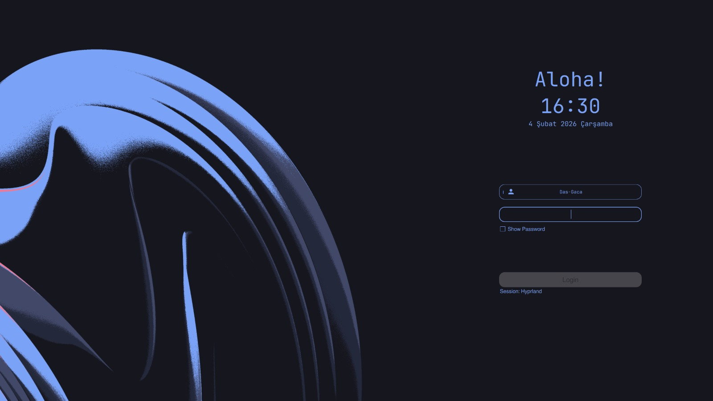
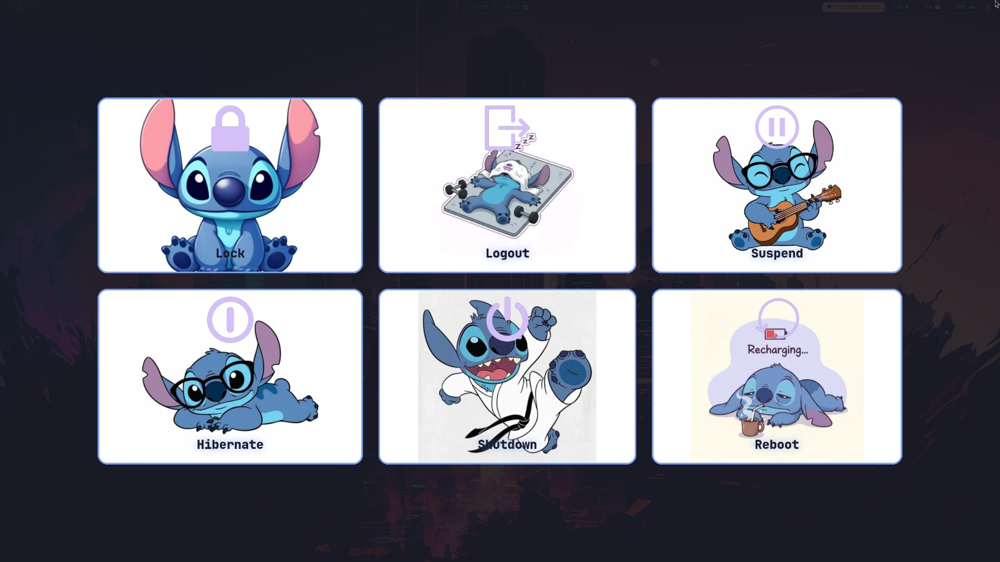

## ARCH LINUX HYPRLAND CUSTOMIZATION

A clean, modern, and highly customizable **Arch Linux + Hyprland** setup.  
This repository contains my personal configuration files (dotfiles) for a Wayland-based desktop environment, focusing on aesthetics, usability, and smooth animations.

- It's not quite finished yet, tests are being conducted.

## Features

- Hyprland window manager configuration
- Waybar status bar styling
- SDDM login screen with Tokyo Night theme
- Wlogout custom logout menu
- Animated wallpaper transitions using `swww`
- Minimal and modern UI design

## Configuration Files

```bash
# Hyprland
~/.config/hypr/hyprland.conf

# Waybar
~/.config/waybar/config
~/.config/waybar/style.css

# Wlogout
~/.config/wlogout/style.css
~/.config/wlogout/icons/
```

- Restart Waybar after changes:
  killall waybar; waybar &
- Or run it detached:
  waybar & disown

## Wallpaper Management

Change wallpaper with smooth transition effects using **swww**:

```bash
# ~/wallpapers/b.png -> write your wallpaper image path here.
swww img ~/wallpapers/b.png --transition-type grow --transition-pos 0.854,0.977 --transition-step 90
```

### Source:

- https://wallpapersafari.com/w/1QAweT

## Edit Theme Configuration

```bash
sudo nano /usr/share/sddm/themes/tokyo-night-sddm/theme.conf
```

## Test SDDM Theme

```bash
sddm-greeter --test-mode --theme /usr/share/sddm/themes/tokyo-night-sddm
```

## SAMPLE VİEW




